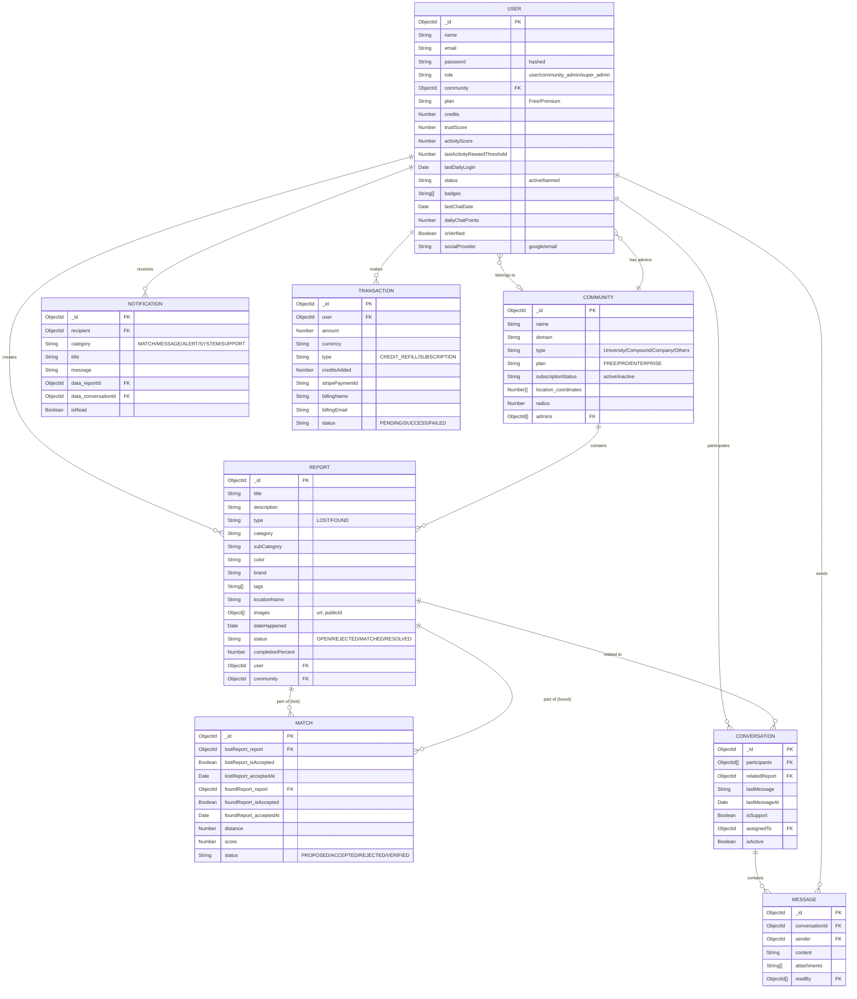

# Foundit Platform Entity-Relationship Diagram (ERD)

This diagram visualizes the MongoDB database schema for the Foundit project, including entities, their attributes, and relationships.

```mermaid
erDiagram
    USER ||--o{ REPORT : "creates"
    USER }o--o| COMMUNITY : "belongs to"
    COMMUNITY ||--o{ USER : "has admins"
    COMMUNITY ||--o{ REPORT : "contains"
    REPORT ||--o{ MATCH : "part of (lost)"
    REPORT ||--o{ MATCH : "part of (found)"
    USER ||--o{ CONVERSATION : "participates"
    REPORT ||--o{ CONVERSATION : "related to"
    CONVERSATION ||--o{ MESSAGE : "contains"
    USER ||--o{ MESSAGE : "sends"
    USER ||--o{ NOTIFICATION : "receives"
    USER ||--o{ TRANSACTION : "makes"

    USER {
        ObjectId _id PK
        String name
        String email
        String password "hashed"
        String role "user/community_admin/super_admin"
        ObjectId community FK
        String plan "Free/Premium"
        Number credits
        Number trustScore
        Number activityScore
        Number lastActivityRewardThreshold
        Date lastDailyLogin
        String status "active/banned"
        String[] badges
        Date lastChatDate
        Number dailyChatPoints
        Boolean isVerified
        String socialProvider "google/email"
    }

    COMMUNITY {
        ObjectId _id PK
        String name
        String domain
        String type "University/Compound/Company/Others"
        String plan "FREE/PRO/ENTERPRISE"
        String subscriptionStatus "active/inactive"
        Number[] location_coordinates
        Number radius
        ObjectId[] admins FK
    }

    REPORT {
        ObjectId _id PK
        String title
        String description
        String type "LOST/FOUND"
        String category
        String subCategory
        String color
        String brand
        String[] tags
        String locationName
        Object[] images "url, publicId"
        Date dateHappened
        String status "OPEN/REJECTED/MATCHED/RESOLVED"
        Number completionPercent
        ObjectId user FK
        ObjectId community FK
    }

    MATCH {
        ObjectId _id PK
        ObjectId lostReport_report FK
        Boolean lostReport_isAccepted
        Date lostReport_acceptedAt
        ObjectId foundReport_report FK
        Boolean foundReport_isAccepted
        Date foundReport_acceptedAt
        Number distance
        Number score
        String status "PROPOSED/ACCEPTED/REJECTED/VERIFIED"
    }

    CONVERSATION {
        ObjectId _id PK
        ObjectId[] participants FK
        ObjectId relatedReport FK
        String lastMessage
        Date lastMessageAt
        Boolean isSupport
        ObjectId assignedTo FK
        Boolean isActive
    }

    MESSAGE {
        ObjectId _id PK
        ObjectId conversationId FK
        ObjectId sender FK
        String content
        String[] attachments
        ObjectId[] readBy FK
    }

    NOTIFICATION {
        ObjectId _id PK
        ObjectId recipient FK
        String category "MATCH/MESSAGE/ALERT/SYSTEM/SUPPORT"
        String title
        String message
        ObjectId data_reportId FK
        ObjectId data_conversationId FK
        Boolean isRead
    }

    TRANSACTION {
        ObjectId _id PK
        ObjectId user FK
        Number amount
        String currency
        String type "CREDIT_REFILL/SUBSCRIPTION"
        Number creditsAdded
        String stripePaymentId
        String billingName
        String billingEmail
        String status "PENDING/SUCCESS/FAILED"
    }
```
